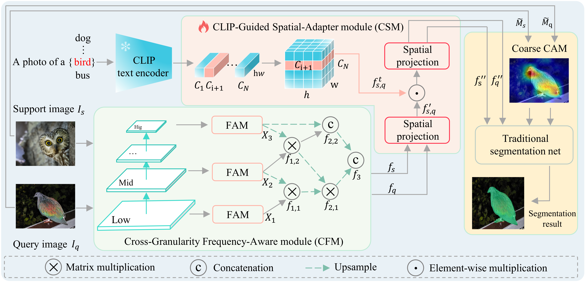
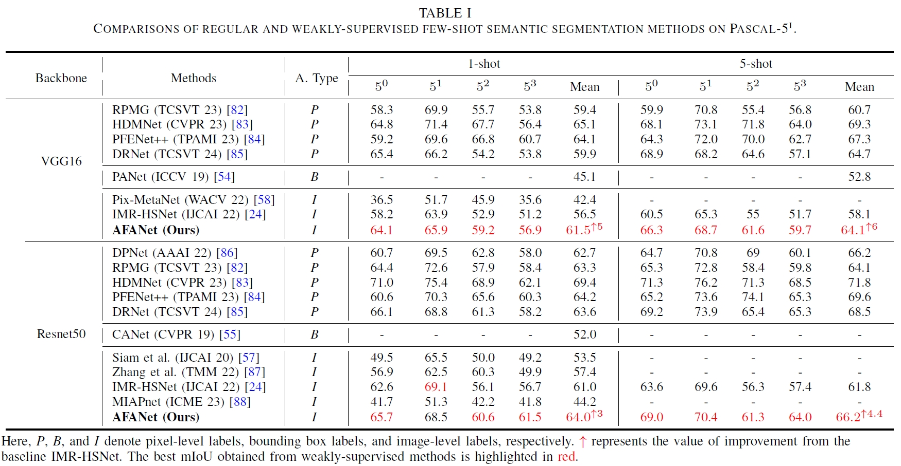

# AFANet: Adaptive Frequency-Aware Network for Weakly-Supervised Few-Shot Semantic Segmentation

This is our official pytorch implementation of AFANet.

Paper Link: [[arXiv](https://arxiv.org/abs/2412.17601)], [[TMM](https://ieeexplore.ieee.org/abstract/document/10906597)]

If you like this project, please ⭐ it on GitHub, Thanks!

## :fire: News
[July 28, 2025]： **Code Fix:** If importing the pretrained model fails in **test.py**, replace **fam** with **fpm** in **model/TLG.py**.

[October 28, 2024]： We uploaded the trained model for testing.

[October 21, 2024]： We have released all the code used for training AFANet.

[October 9, 2024]： AFANet is accepted by IEEE Transactions on Multimedia (TMM).

## Abstract
<div align=center></div> 

Few-shot learning aims to recognize novel concepts by leveraging prior knowledge learned from a few samples. However, for visually intensive tasks such as few-shot semantic segmentation, pixel-level annotations are time-consuming and costly. Therefore, in this work, we utilize the more challenging image-level annotations and propose an adaptive frequency-aware network (AFANet) for weakly-supervised few-shot semantic segmentation (WFSS). Specifically, we first propose a cross-granularity frequency-aware module (CFM) that decouples RGB images into high-frequency and low-frequency distributions and further optimizes semantic structural information by realigning them. Unlike most existing WFSS methods using the textual information from the language-vision model CLIP in an offline learning manner, we further propose a CLIP-guided spatial-adapter module (CSM), which performs spatial domain adaptive transformation on textual information through online learning, thus providing cross-modal semantic information for CFM. Extensive experiments on the Pascal-5 and COCO-20 datasets demonstrate that AFANet has achieved state-of-the-art performance.

## Experiments
<div align=center></div> 

## Environment settings:
```bash
conda create -n afanet python=3.10
conda activate afanet
pip3 install torch torchvision torchaudio
conda install -c conda-forge tensorflow
pip install tensorboardX
pip install ftfy
pip install regex
pip install ttach
```

## Preparing Few-Shot Segmentation Datasets
Download following datasets:

> #### 1. PASCAL-5<sup>i</sup>
> Download PASCAL VOC2012 devkit (train/val data):
> ```bash
> wget http://host.robots.ox.ac.uk/pascal/VOC/voc2012/VOCtrainval_11-May-2012.tar
> ```
> Download PASCAL VOC2012 SDS extended mask annotations from HSNet [[Google Drive](https://drive.google.com/file/d/10zxG2VExoEZUeyQl_uXga2OWHjGeZaf2/view?usp=sharing)].


> #### 2. COCO-20<sup>i</sup>
> Download COCO2014 train/val images and annotations: 
> ```bash
> wget http://images.cocodataset.org/zips/train2014.zip
> wget http://images.cocodataset.org/zips/val2014.zip
> wget http://images.cocodataset.org/annotations/annotations_trainval2014.zip
> ```
> Download COCO2014 train/val annotations from HSNet Google Drive: [[train2014.zip](https://drive.google.com/file/d/1cwup51kcr4m7v9jO14ArpxKMA4O3-Uge/view?usp=sharing)], [[val2014.zip](https://drive.google.com/file/d/1PNw4U3T2MhzAEBWGGgceXvYU3cZ7mJL1/view?usp=sharing)].

## Preparing Pre-trained models：
Download pre-trained weights (Backbone): ResNet50, VGG16 and ViT (CLIP) from Hugging Face: [[Backbone](https://huggingface.co/datasets/Jarch-ma/AFANet/tree/main)].


Create a directory 'Dataset', and arrange the data in the following way:
```bash
    Dataset/                       
    └── Datasets_AFANet/
        ├── VOC2012/            # PASCAL VOC2012 devkit
        │   ├── Annotations/
        │   ├── ImageSets/
        │   ├── ...
        │   └── SegmentationClassAug/
        ├── COCO2014/           
        │   ├── annotations/
        │   │   ├── train2014/  # (dir.) training masks (from Google Drive) 
        │   │   ├── val2014/    # (dir.) validation masks (from Google Drive)
        │   │   └── ..some json files..
        │   ├── train2014/
        │   └── val2014/
        ├── CAM_VOC_Train/ 
        ├── CAM_VOC_Val/ 
        └── CAM_COCO/
 ```      

## Preparing CAM for Few-Shot Segmentation Datasets
> ### 1. PASCAL-5<sup>i</sup>
> * Generate Grad CAM for images
> ```bash
> python generate_cam_voc.py --traincampath ../afanet_data/CAM_VOC_Train/
>                            --valcampath ../afanet_data/CAM_VOC_Val/
> ```

### 2. COCO-20<sup>i</sup>
> ```bash
> python generate_cam_coco.py --campath ../afanet_data/CAM_COCO/

## Training
> ### 1. PASCAL-5<sup>i</sup>
> ```bash
> python train.py --backbone {vgg16, resnet50} 
>                 --fold {0, 1, 2, 3} 
>                 --benchmark pascal
>                 --lr 4e-4
>                 --bsz 16
>                 --stage 2
>                 --logpath "your_experiment_name"
>                 --traincampath ../afanet_data/CAM_VOC_Train/
>                 --valcampath ../afanet_data/CAM_VOC_Val/
> ```
> * Training takes approx. 6~7 hours until convergence (trained with two RTX 3090 GPUs).


> ### 2. COCO-20<sup>i</sup>
> ```bash
> python train.py --backbone {vgg16, resnet50}
>                 --fold {0, 1, 2, 3} 
>                 --benchmark coco 
>                 --lr 1e-4
>                 --bsz 20
>                 --stage 3
>                 --logpath "your_experiment_name"
>                 --traincampath ../afanet_data/CAM_COCO/
>                 --valcampath ../afanet_data/CAM_COCO/
> ```
> * Training takes approx. 2 days until convergence (trained with four RTX 3090 GPUs).

### Babysitting training:
> Use tensorboard to babysit training progress:
- For each experiment, a directory that logs training progress will be automatically generated under logs/ directory. 
- From terminal, run 'tensorboard --logdir logs/' to monitor the training progress.
- Choose the best model when the validation (mIoU) curve starts to saturate. 

## Testing

> ### 1. PASCAL-5<sup>i</sup>
> Checkpoint with tensorboard logs are available on our [[Hugging Face](https://huggingface.co/datasets/Jarch-ma/AFANet/tree/main/checkpoint))].
> ```bash
> python test.py --backbone {vgg16, resnet50} 
>                --fold {0, 1, 2, 3} 
>                --benchmark pascal
>                --nshot {1, 5} 
>                --load "/opt/data/private/Code/AFANet/Pretrain/vis/voc_fold_0.pt" 
> ```

> ### 2. COCO-20<sup>i</sup>
> Checkpoint with tensorboard logs are available on our [[Hugging Face](https://huggingface.co/datasets/Jarch-ma/AFANet/tree/main/checkpoint)].
> ```bash
> python test.py --backbone {vgg16, resnet50} 
>                --fold {0, 1, 2, 3} 
>                --benchmark coco 
>                --nshot {1, 5} 
>                --load "/opt/data/private/Code/AFANet/Pretrain/vis/coco_fold_0.pt"
> ```

## Visualization
> ```bash
> python test.py --backbone {vgg16, resnet50} 
>                --fold {0, 1, 2, 3} 
>                --benchmark pascal
>                --nshot {1, 5}
>                --visualize 'visualize'
>                --load "/opt/data/private/Code/AFANet/Pretrain/vis/voc_fold_0.pt" 
> ```

## Email:
If you have any questions, please contact me: machiachi@163.com


## BibTeX
If you use this code for your research, please consider citing:
````
@ARTICLE{10906597,
  author={Ma, Jiaqi and Xie, Guo-Sen and Zhao, Fang and Li, Zechao},
  journal={IEEE Transactions on Multimedia}, 
  title={AFANet: Adaptive Frequency-Aware Network for Weakly-Supervised Few-Shot Semantic Segmentation}, 
  year={2025},
  volume={27},
  pages={4018-4028}
}
````
